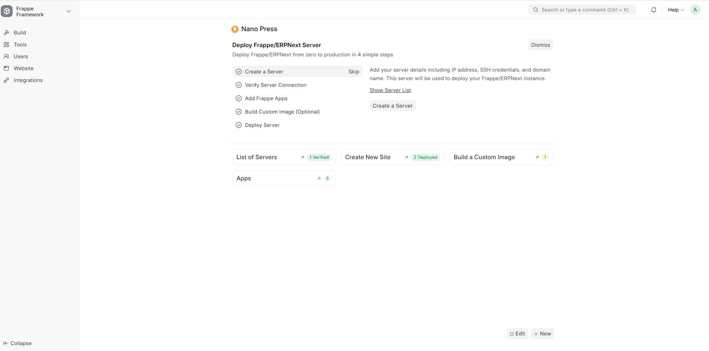
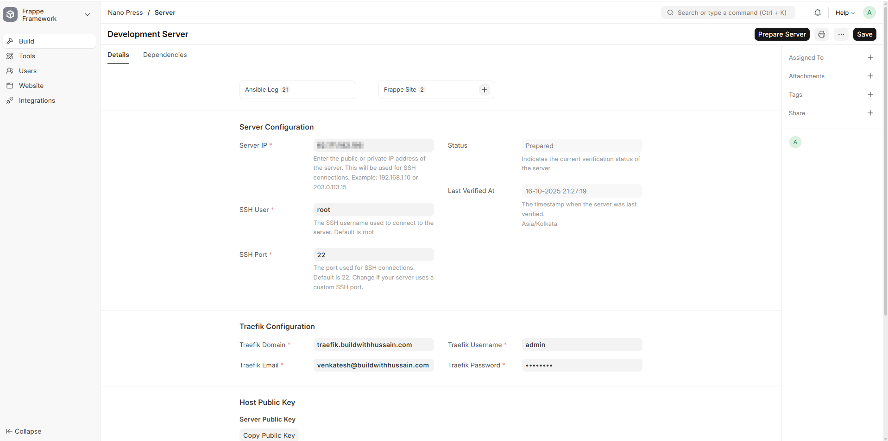
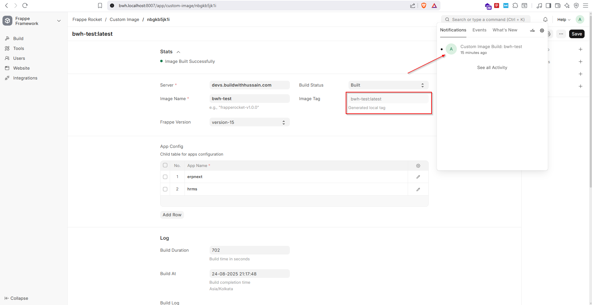
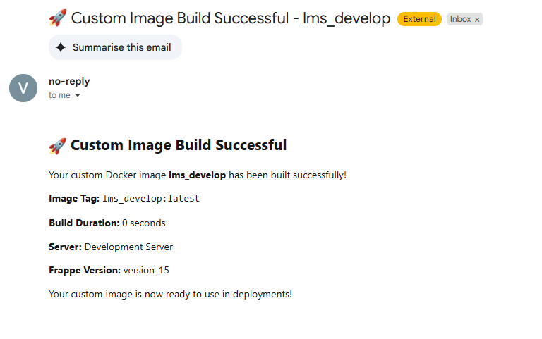

### Nano Press

Nano Press automates your Frappe/ERPNext deployment from zero to production. Connect your server, pick your version, add official or custom GitHub apps, set your domain, and launch — all in one smooth workflow. Built for quick proof-of-concepts, but powerful enough for real-world use.

## 🚀 Deployment Guide

This guide will walk you through deploying a Frappe/ERPNext server using Nano Press, from server setup to production deployment.

### Nano Press Dashboard

The Nano Press application provides an intuitive dashboard to manage your Frappe/ERPNext deployments:



*Note: Screenshot shows the main Nano Press interface with deployment workflow and management options.*

### Prerequisites

Before starting, ensure you have:

- A Frappe/ERPNext instance with Nano Press app installed
- A Linux server (Ubuntu 20.04+ recommended) with SSH access
- sudo access on the target server
- A domain name (optional, for SSL setup)

### Step 1: Server Setup

#### 1.1 Prepare Your Server

First, ensure your server meets the minimum requirements:

- **OS**: Ubuntu 20.04 LTS or later
- **RAM**: Minimum 4GB (8GB recommended for production)
- **Storage**: Minimum 20GB available space
- **Network**: Open ports 22 (SSH), 80 (HTTP), 443 (HTTPS)

**Note**: Docker and Docker Compose will be automatically installed during the server preparation process. No manual installation is required.

### Step 2: Add Server to Nano Press

#### 2.1 Navigate to Server Doctype

1. Click on **Server** in the sidebar
2. Click **New** to add a new server



#### Video Tutorial: Server Creation

Watch this step-by-step video guide for adding and configuring a server:

<video controls style="width: 100%; height: auto;" src="nano_press/public/images/addserver.mp4" title="Server Creation Tutorial"></video>

#### 2.2 Configure and Verify Server

Follow the video tutorial above to configure server details and verify the connection.

### Step 3: Configure Apps (Optional)

#### 3.1 Add Custom Apps

#### Video Tutorial: Adding Private and Public Apps

Watch this step-by-step video guide for adding custom apps:

<video controls style="width: 100%; height: auto;" src="nano_press/public/images/addapps.mp4" title="Adding Apps Tutorial"></video>

### Step 3.5: Build Custom Image (Optional)

#### 3.5.1 Build Custom Image

#### Video Tutorial: Building Custom Apps

Watch this step-by-step video guide for building custom images with pre-installed apps:

<video controls style="width: 100%; height: auto;" src="nano_press/public/images/imagebuild.mp4" title="Building Custom Apps Tutorial"></video>

#### 3.5.2 Monitor Build Process

The build process may take up to 30 minutes depending on the number of apps selected:

1. Monitor the build progress in the **Build Log** section
2. **You will receive a system notification when the image build is complete**
3. Wait for the build status to change to "Built"
4. The custom image will be available for deployment



**Note**: Custom images significantly reduce deployment time for subsequent deployments with the same app configuration. You will receive both system notifications and email notifications when the build process is finished, so you don't need to continuously monitor the progress.



### Step 4: Deploy Your Instance

#### 4.1 Create and Deploy Frappe Site

#### Video Tutorial: Frappe Site Creation

Watch this step-by-step video guide for creating and deploying a Frappe site:

<video controls style="width: 100%; height: auto;" src="nano_press/public/images/1016.mp4" title="Frappe Site Creation Tutorial"></video>
#### 4.2 Access Your Site

Once deployment is complete, you can access your Frappe/ERPNext instance:

- **URL**: `http://your-server-ip:8000` (or `https://your-domain` if SSL enabled)
- **Username**: `Administrator`
- **Password**: The password you set during deployment

Your Frappe/ERPNext instance is now ready for use! You can access it through your web browser and begin configuring your business.

---

### Installation

You can install this app using the [bench](https://github.com/frappe/bench) CLI:

```bash
cd $PATH_TO_YOUR_BENCH
bench get-app $URL_OF_THIS_REPO --branch develop
bench install-app nano_press
```

### Contributing

This app uses `pre-commit` for code formatting and linting. Please [install pre-commit](https://pre-commit.com/#installation) and enable it for this repository:

```bash
cd apps/nano_press
pre-commit install
```

Pre-commit is configured to use the following tools for checking and formatting your code:

- ruff
- eslint
- prettier
- pyupgrade
### CI

This app can use GitHub Actions for CI. The following workflows are configured:

- CI: Installs this app and runs unit tests on every push to `develop` branch.
- Linters: Runs [Frappe Semgrep Rules](https://github.com/frappe/semgrep-rules) and [pip-audit](https://pypi.org/project/pip-audit/) on every pull request.


### License

mit