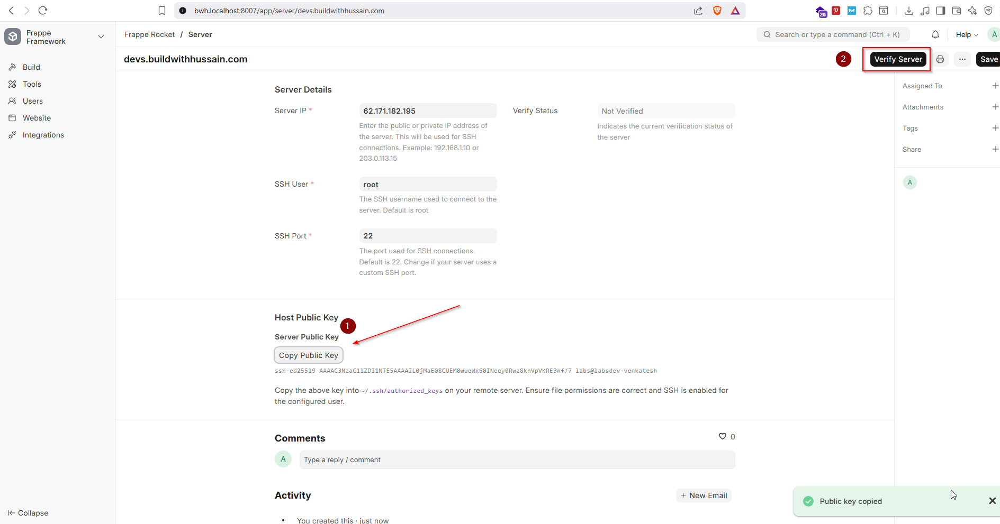
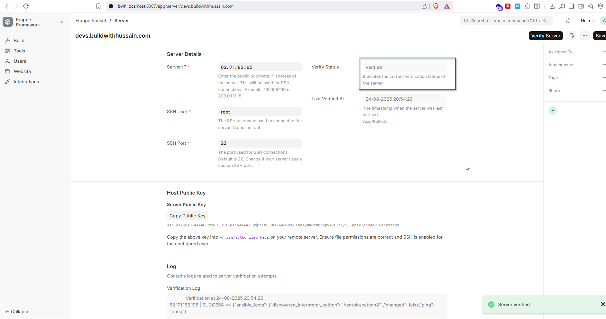
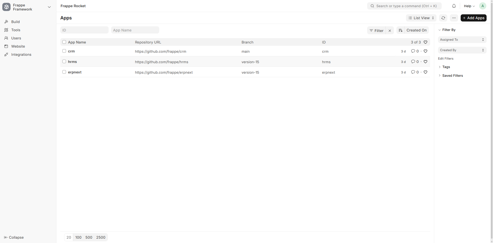
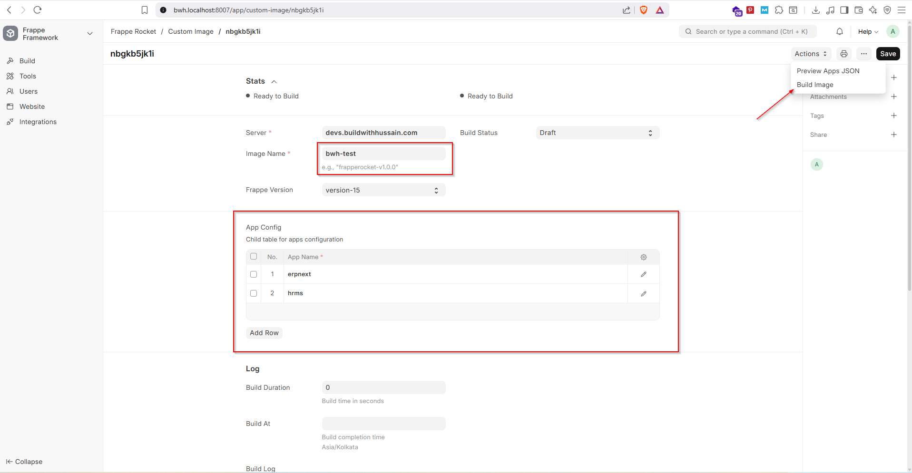
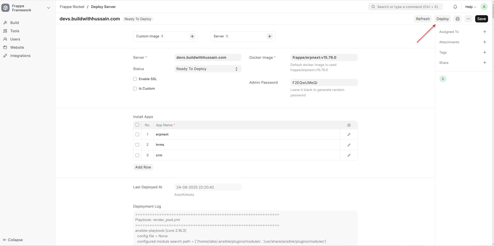
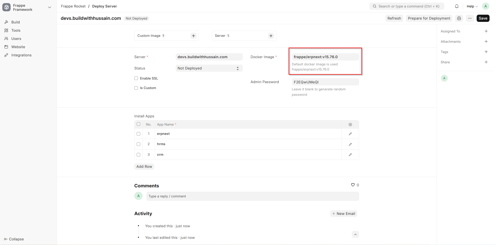
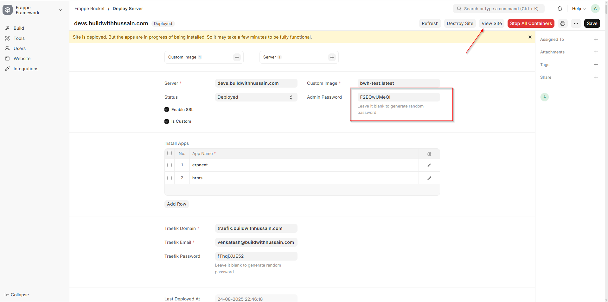

### Nano Press

Nano Press automates your Frappe/ERPNext deployment from zero to production. Connect your server, pick your version, add official or custom GitHub apps, set your domain, and launch — all in one smooth workflow. Built for quick proof-of-concepts, but powerful enough for real-world use.

## 🚀 Deployment Guide

This guide will walk you through deploying a Frappe/ERPNext server using Nano Press, from server setup to production deployment.

### Prerequisites

Before starting, ensure you have:

- A Frappe/ERPNext instance with Nano Press app installed
- A Linux server (Ubuntu 20.04+ recommended) with SSH access
- sudo access on the target server
- A domain name (optional, for SSL setup)

### Step 1: Server Setup

#### 1.1 Prepare Your Server

First, ensure your server meets the minimum requirements:

- **OS**: Ubuntu 20.04 LTS or later
- **RAM**: Minimum 4GB (8GB recommended for production)
- **Storage**: Minimum 20GB available space
- **Network**: Open ports 22 (SSH), 80 (HTTP), 443 (HTTPS)

**Note**: Docker and Docker Compose will be automatically installed during the server preparation process. No manual installation is required.

### Step 2: Add Server to Nano Press

#### 2.1 Navigate to Server Doctype

1. Click on **Server** in the sidebar
2. Click **New** to add a new server


#### 2.2 Configure Server Details

Fill in the server configuration:

- **Domain Name**: Enter your server's domain or hostname (e.g., `mycompany.com` or `server1.example.com`)
- **Server IP**: Enter the public IP address of your server
- **SSH User**: Usually `root` (default)
- **SSH Port**: Usually `22` (default)



#### 2.3 Verify Server Connection

1. Click **Save** to create the server record
2. Click **Verify Server** to test the SSH connection
3. **Important**: Copy the public key displayed in the verification log
4. Add this public key to your server's authorized keys:

```bash
# SSH into your server
ssh root@your-server-ip

# Add the public key to authorized_keys
echo "YOUR_PUBLIC_KEY_HERE" >> ~/.ssh/authorized_keys

# Set proper permissions
chmod 600 ~/.ssh/authorized_keys
chmod 700 ~/.ssh
```

5. Wait for the verification process to complete



**Note**: The verification process will:
- Test SSH connectivity
- **Require the public key to be added to authorized_keys for successful verification**

### Step 3: Configure Apps (Optional)

#### 3.1 Add Custom Apps

If you want to install custom apps beyond ERPNext:

1. Go to **Apps** Doctype
2. Click **New** to add a new app
3. Configure the app details:
   - **App Name**: Name of the app
   - **Repository URL**: GitHub repository URL
   - **Branch**: Branch to install from (e.g., `develop`, `main`)
   - **Is Private**: Check if it's a private repository
   - **PAT Token**: Personal Access Token for private repos



### Step 3.5: Build Custom Image (Optional)

#### 3.5.1 Create Custom Image

For faster deployments and better performance, you can build a custom Docker image with your apps pre-installed:

1. Go to **Custom Image** Doctype
2. Click **New** to create a new custom image
3. Configure the image details:
   - **Server**: Choose the server to which this image to be build on.
   - **Verion**: Choose the Framwork version.
   - **Image name**: Keep a valid image name to be used.
   - **Apps to Include**: Select the apps you want pre-installed
   - **Build Configuration**: Set build parameters



#### 3.5.2 Monitor Build Process

The build process may take up to 30 minutes depending on the number of apps selected:

1. Monitor the build progress in the **Build Log** section
2. **You will receive a system notification when the image build is complete**
3. Wait for the build status to change to "Built"
4. The custom image will be available for deployment


**Note**: Custom images significantly reduce deployment time for subsequent deployments with the same app configuration. The system will notify you when the build process is finished, so you don't need to continuously monitor the progress.

### Step 4: Deploy Your Instance

#### 4.1 Create Deployment

1. Go to **Frappe Site** Doctype
2. Click **New** to create a new deployment
3. Select your verified server from the dropdown
4. The server name will be automatically fetched from the server configuration



#### 4.2 Configure Deployment Settings

Fill in the deployment configuration:

**Basic Settings:**
- **Site Name**: Choose a unique site name (e.g., `mycompany`)
- **Admin Password**: Set the admin password (or leave blank for auto-generation)
- **Docker Image**: By default, `frappe/erpnext:v15.76.0` will be used (contains only ERPNext)

**Custom Image Configuration:**
- **Is Custom**: Check this if you want to install additional apps
- **Custom Image**: Select the custom image you built earlier
- **Apps Section**: Will be automatically populated with all apps used to build the custom image

**SSL Configuration (Optional):**
- **Enable SSL**: Check to enable HTTPS
- **Traefik Domain**: Your domain name (e.g., `erp.mycompany.com`) - **Mandatory if SSL is enabled**
- **Traefik Email**: Email for Let's Encrypt certificates - **Mandatory if SSL is enabled**
- **Traefik Password**: Password for Traefik dashboard



#### 4.3 Prepare for Deployment

1. Review all settings
2. Click **Prepare for Deployment**
3. This process will:
   - Install Docker and Docker Compose if they don't exist
   - Install the Frappe Docker repository
   - Override the `pwd.yml` file with your deployment details
   - Set up the deployment environment

#### 4.4 Deploy Your Server

1. Once the status changes to "Ready to Deploy"
2. Click **Deploy** to start the deployment process
3. This will execute `docker compose up` on your server



#### 4.5 Access Your Site

1. Wait for the deployment to complete (5-10 minutes depending on apps)
2. You'll see a **Visit Site** button appear
3. Click **Visit Site** to access your Frappe/ERPNext instance

**Important Notes:**
- **For Production**: Configure your domain name to point to your server IP
- **For Local Development**: Don't use SSL and map your IP to hostname in `/etc/hosts` file
- **Access Details**: 
  - **URL**: `http://your-server-ip:8000` (or `https://your-domain` if SSL enabled)
  - **Username**: `Administrator`
  - **Password**: The password you set during deployment

### Step 5: Monitor Deployment

#### 5.1 Track Progress

The deployment process will:

1. **Prepare Environment**: Install Docker, Docker Compose, and Frappe repository
2. **Initialize**: Set up Docker containers and networks
3. **Install Frappe**: Install Frappe framework
4. **Install ERPNext**: Install ERPNext application
5. **Install Custom Apps**: Install any additional apps (if using custom image)
6. **Configure SSL**: Set up HTTPS if enabled
7. **Finalize**: Complete setup and start services

You can monitor progress in the **Deployment Log** section.


#### 5.2 Deployment Status

- **Not Deployed**: Initial state
- **Ready to Deploy**: After "Prepare for Deployment" is complete
- **Deploying**: During the deployment process
- **Deployed**: Successfully completed
- **Failed**: If deployment encounters errors

#### 5.3 Access Your Instance

Once deployment is complete and status shows "Deployed":

- Click the **Visit Site** button to access your Frappe/ERPNext instance
- **URL**: `http://your-server-ip:8000` (or `https://your-domain` if SSL enabled)
- **Username**: `Administrator`
- **Password**: The password you set during deployment

Your Frappe/ERPNext instance is now ready for use! You can access it through your web browser and begin configuring your business.

---

### Installation

You can install this app using the [bench](https://github.com/frappe/bench) CLI:

```bash
cd $PATH_TO_YOUR_BENCH
bench get-app $URL_OF_THIS_REPO --branch develop
bench install-app nano_press
```

### Contributing

This app uses `pre-commit` for code formatting and linting. Please [install pre-commit](https://pre-commit.com/#installation) and enable it for this repository:

```bash
cd apps/nano_press
pre-commit install
```

Pre-commit is configured to use the following tools for checking and formatting your code:

- ruff
- eslint
- prettier
- pyupgrade
### CI

This app can use GitHub Actions for CI. The following workflows are configured:

- CI: Installs this app and runs unit tests on every push to `develop` branch.
- Linters: Runs [Frappe Semgrep Rules](https://github.com/frappe/semgrep-rules) and [pip-audit](https://pypi.org/project/pip-audit/) on every pull request.


### License

mit
